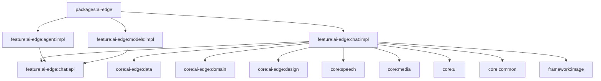
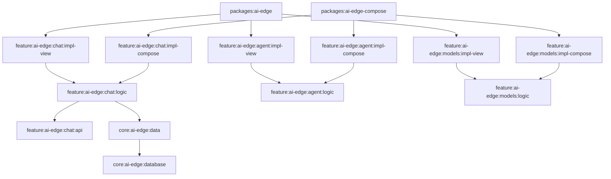

# View 与 Compose 双体系架构蓝图

> 本文档基于对 `packages/ai-edge` 宿主工程的真实代码审计，描述从当前 View 体系演进到 View + Compose
> 双版本并行的最终架构蓝图。目标是：底层与业务逻辑复用，UI 渲染层彻底物理隔离。
---

## 一、审计范围与结论摘要

### 1.1 审计范围

本次蓝图只围绕 `packages/ai-edge` 向下追踪的真实物理模块展开，覆盖：

- 宿主：`packages/ai-edge`
- 业务：`feature/ai-edge/{agent,chat,explore,meeting,models,vision}` 的 `api/impl`
- 基础：`core/{common,media,res,speech,ui,ai-edge/*}`
- 框架：`framework/{download,image,mlkit,network,player}`

### 1.2 统一结论

当前工程已经具备“共享业务逻辑层 + 双 UI 宿主”的迁移前提，但必须严格按以下边界执行：

- **业务逻辑层独立 logic**：`chat/agent/models` 的 ViewModel 与纯状态类迁移到独立的 `*-logic` 模块。
- **UI 宿主必须隔离**：`Activity/Fragment/Adapter/XML/RecyclerView DiffCallback` 只保留在 `*-impl-view` 中。
- **Compose 宿主独立打包**：`packages:ai-edge-compose` 只依赖 `*-impl-compose` 与 `*-logic`。
- **基础设施分级复用**：不是所有 core/framework 都“完全纯净”，必须按真实依赖重新归类。

---

## 二、全局模块复用性分类清单

### 2.1 完全复用模块

| 模块 | 依赖与证据 | 结论 |
| :--- | :--- | :--- |
| `framework:network` | `Retrofit` / `OkHttp`，无 `android.view` | 完全复用 |
| `framework:download` | `androidx.work.runtime.ktx`，无 View 组件 | 完全复用 |
| `framework:image` | `Coil` / `coil-okhttp`，Compose 原生可用 | 完全复用 |
| `core:ai-edge:database` | `Room` / `DAO` / `Entity` | 完全复用 |
| `core:ai-edge:data` | `Repository`、网络、下载、LiteRT；`build.gradle.kts` 无 View 依赖 | 完全复用 |
| `core:ai-edge:domain` | `UseCase`、`ActiveModelHolder`、仅 Hilt/Context 系统引用 | 完全复用 |
| `core:common` | KTX / Lifecycle-process | 完全复用 |
| `core:speech` | `SpeechRecognitionClient`、协程、下载框架 | 完全复用 |
| 各 `feature:ai-edge:*:api` | 纯接口层，当前 `api` 模块无实现 | 完全复用底座 |

### 2.2 部分复用模块（含 View UI 依赖）

| 模块 | 原因分析 | 结论 |
| :--- | :--- | :--- |
| `framework:player` | `framework/player/build.gradle.kts:12` 引入 `media3.ui`，属于 View 体系播放器组件；核心播放能力可复用，但 UI 组件不应进入 Compose 宿主 | 部分复用（含 View UI 依赖） |
| `framework:mlkit` | `framework/mlkit/build.gradle.kts:18` 引入 `camera.view`，说明存在 `PreviewView` 这类 View 预览组件；算法能力可复用，预览 UI 需独立封装 | 部分复用（含 View UI 依赖） |
| `core:media` | `core/media/build.gradle.kts:11` 引入 `appcompat`，说明该层已混入 View 基础设施；可继续复用，但建议后续二次剥离 | 可复用但建议二次剥离（因依赖 appcompat） |
| `core:ai-edge:data` 中部分仓库能力 | `ModelsManagerViewModel` 仍直接触达文件路径与状态读取，说明数据层与平台能力边界需要再抽象 | 部分复用，需能力下沉 |

### 2.3 必须双轨隔离模块

| 模块 | 原因分析 | 结论 |
| :--- | :--- | :--- |
| `core:ui` | `core/ui/build.gradle.kts:11-12` 直接依赖 `appcompat` / `material`，且包含 `BaseUIActivity`、`VoiceWaveView`、RecyclerView 相关 UI 组件 | 必须双轨隔离 |
| `core:res` | `core/res/build.gradle.kts:11-12` 直接依赖 `appcompat` / `material`，属于 View 资源体系 | 必须双轨隔离 |
| `core:ai-edge:design` | `core:ai-edge:design/build.gradle.kts:10` 依赖 `material`，是 View 风格设计系统 | 必须双轨隔离 |
| `packages:ai-edge`    | 宿主当前直接装配 `Fragment impl`，无法作为 Compose 独立宿主继续演进 | 必须双轨隔离，新增 `packages:ai-edge-compose` |

---

## 三、重构后模块依赖拓扑图

### 3.1 当前现状拓扑



### 3.2 目标拓扑



### 3.3 职责边界

- **logic**：**业务逻辑中枢**。承载 ViewModel、UseCase、纯状态类。实现 `api` 定义的业务逻辑接口。
- **impl-view**：View 渲染层。实现 View 体系独有的导航实现，负责 XML/Fragment 布局。
- **impl-compose**：Compose 渲染层。处理 Navigation3 路由，负责 Screen 组件。
- **api**：模块协议中心。定义业务逻辑接口（Service）、数据契约、以及 Compose 体系的路由 Key。

---

## 四、ViewModel 与状态类下沉体检

### 4.1 判定标准

满足以下任一条件即不能直接下沉：

- `import android.view.*`
- `import android.widget.*`
- `R.layout` / `R.id`
- `Fragment` / `Activity`
- `RecyclerView.Adapter`、`ViewHolder`、`DiffUtil`

### 4.2 可直接下沉的 ViewModel / 状态类

| 类 | 审计结论 |
| :--- | :--- |
| `ChatDetailViewModel` | 可下沉至 `chat:logic`；Context 需下沉至 Repository 托管 |
| `ChatHomeViewModel` | 可直接下沉至 `chat:logic` |
| `AgentHomeViewModel` | 可直接下沉至 `agent:logic` |
| `ModelsManagerViewModel` | 含文件操作；需重构 Repository 后下沉至 `models:logic` |
| `ChatDetailUiState` | 可直接下沉 |
| `ChatDetailEffect` | 可直接下沉 |
| `VoiceInputUiState` | 可直接下沉 |
| `SelectedImageState` | 可直接下沉 |
| `ModelManagerUiState` | 可直接下沉 |
| `ModelUiState` | 可直接下沉 |

### 4.3 明确禁止下沉的类

| 类 | 原因 |
| :--- | :--- |
| `ChatHomeDiffCallback` | 直接依赖 `androidx.recyclerview.widget.DiffUtil`，必须保留在 `impl-view` |
| `ModelDiffCallback`    | 直接依赖 `DiffUtil` 和 `Bundle`，必须保留在 `impl-view` |

---

## 五、 能力下沉与 Repository 强化

### 5.1 现状边界分析

审计发现 `ModelsManagerViewModel` 存在严重的“职责越权”行为，其核心逻辑中混入了大量的平台物理操作。下沉至 Repository 的核心依据如下：

1. **解耦平台依赖**：ViewModel 位于 `logic` 模块，目标是纯 Kotlin。直接引用 `java.io.File` 和 `Context` 会强行捆绑 Android SDK。
2. **数据源抽象**：ViewModel 只应表达“删除模型”的业务意图，而“寻找路径”和“执行删除”属于数据层的实现细节。
3. **隐藏存储细节**：物理路径计算逻辑属于 Repository 的内部细节，不应暴露给业务层。

### 5.2 标准化实现方案

业务逻辑层 logic 统一面向 Repository 编程，Repository 在 `core:ai-edge:data` 中负责屏蔽物理路径细节。

**Repository 实现示范:**
```kotlin
class ModelRepository @Inject constructor(@ApplicationContext private val context: Context) {
  suspend fun deleteModelFile(model: Model) = withContext(Dispatchers.IO) {
    val file = File(model.getPath(context))
    if (file.exists()) file.delete()
  }
}
```

---

## 六、 模块协作：逻辑服务化与体系化导航

为了保证架构的优雅与体系原生实现，我们将**业务逻辑调用**与**UI 页面跳转**彻底解耦。

### 6.1 逻辑接口服务化 (Logic Service)
跨模块的业务逻辑调用通过接口实现。接口定义在 `api`，实现在 `logic`。

1. **接口定义 (models:api)**：
 ```kotlin
 interface ModelsService {
       fun isModelReady(id: String): Boolean
   }
   ```
2. **业务实现 (models:logic)**：
 ```kotlin
 class ModelsServiceImpl @Inject constructor(repository: ModelRepository) : ModelsService {
       override fun isModelReady(id: String) = repository.checkFileExists(id)
   }
   ```
3. **调用方 (chat:logic)**：直接注入 `ModelsService` 进行逻辑交互，无需感知任何 UI 模块。

### 6.2 体系化导航 (Separated Navigation)

不再强行统一 View 和 Compose 的导航接口。ViewModel 仅通过 **意图事件 (Effect)** 表达跳转需求。

**核心思想：**
- **统一意图**：所有跳转均由 ViewModel 产出 `Effect` 意图，不关心跳转目标是模块内还是模块外。
- **Compose 扁平化**：利用 Nav3 的状态特性，跨模块跳转与模块内跳转对等，均通过 `NavKey` 实现“无接口化”跳转。
- **View 桥接化**：受限于 Activity 强耦合，跨模块跳转采用“接口契约 + Hilt 注入”的经典模式解耦。

#### 6.2.1 模块内跳转 (Internal Navigation)
ViewModel 发射本模块意图，UI 层直接处理。

```kotlin
// 1. ViewModel 发射意图 (logic 模块)
@HiltViewModel
class ModelsViewModel @Inject constructor(...) : ViewModel() {
    private val _effect = MutableSharedFlow<ModelsEffect>()
    val effect = _effect.asSharedFlow()

    fun onModelClick(id: String) {
        viewModelScope.launch { _effect.emit(ModelsEffect.NavigateToDetail(id)) }
    }
}

// 2. Compose 体系实现 (impl-compose 模块)
@Composable
fun ModelsScreen(viewModel: ModelsViewModel, navigator: Navigator) {
    LaunchedEffect(Unit) {
        viewModel.effect.collect { effect ->
            if (effect is ModelsEffect.NavigateToDetail) {
                // 模块内：直接使用本模块定义的 NavKey
                navigator.navigate(ModelDetailKey(effect.id)) 
            }
        }
    }
}

// 3. View 体系实现 (impl-view 模块)
class ModelsFragment : Fragment() {
    override fun onViewCreated(...) {
        viewLifecycleOwner.lifecycleScope.launch {
            viewModel.effect.collect { effect ->
                if (effect is ModelsEffect.NavigateToDetail) {
                    // 模块内：直接使用本模块的 Activity 类名
                    val intent = Intent(context, ModelDetailActivity::class.java).apply { putExtra("ID", effect.id) }
                    startActivity(intent)
                }
            }
        }
    }
}
```

#### 6.2.2 跨模块跳转 (Cross-Feature Navigation)
当 Feature A 需要跳转到 Feature B 时。

**1. Compose 体系：协议握手 (Effect -> BNavKey)**
`impl-compose-A` 依赖 `api-B`。捕获意图后，直接操作 Feature B 暴露在协议层的 Key。
```kotlin
// impl-compose-A 模块 (依赖 models:api)
@Composable
fun ChatScreen(viewModel: ChatViewModel, navigator: Navigator) {
    LaunchedEffect(Unit) {
        viewModel.effect.collect { effect ->
            if (effect is ChatEffect.OpenModelSettings) {
                // Compose 天然解耦：只需引用 api-B 中定义的数据结构
                navigator.navigate(ModelsSettingsKey()) 
            }
        }
    }
}
```

**2. View 体系：接口桥接 (Effect -> BNavigator)**
由于跨模块 Activity 跳转涉及类名硬编码，必须在 **`api-B`** 中定义导航协议，并通过 Hilt 注入。
```kotlin
// 1. 定义协议 (models:api)
interface ModelsNavigator {
    fun toSettings(context: Context)
}

// 2. 提供实现 (models:impl-view)
class ModelsNavigatorImpl @Inject constructor() : ModelsNavigator {
    override fun toSettings(context: Context) {
        context.startActivity(Intent(context, ModelsSettingsActivity::class.java))
    }
}

// 3. 调用跳转 (chat:impl-view)
class ChatFragment : Fragment() {
    @Inject lateinit var modelsNavigator: ModelsNavigator // Hilt 注入 B 模块的导航协议契约

    override fun onViewCreated(...) {
        viewModel.effect.collect { effect ->
            if (effect is ChatEffect.OpenModelSettings) {
                modelsNavigator.toSettings(requireContext())
            }
        }
    }
}
```

---

## 七、 最终搬迁清单

### 7.1 可直接下沉至 logic
- `chat:logic`：`ChatDetailViewModel`、`ChatHomeViewModel`、`ChatDetailUiState`、`ChatDetailEffect`、`VoiceInputUiState`、`SelectedImageState`。
- `agent:logic`：`AgentHomeViewModel`。
- `models:logic`：`ModelsServiceImpl`、重构后的 `ModelsManagerViewModel`。

### 7.2 需微调后下沉
- `ModelsManagerViewModel`：先强化 `ModelRepository`，移除 ViewModel 内的文件物理操作。
- `core:media`：保留复用，但建议后续拆分 `media-contract` / `media-android`。

### 7.3 禁止下沉 (保留在 impl-view)
- `ChatHomeDiffCallback` / `ModelDiffCallback`。
- 全部 `Activity` / `Fragment` / `Adapter` / XML。

---

## 八、 Compose 宿主工程依赖样例

```kotlin
dependencies {
  implementation(project(":feature:ai-edge:chat:logic"))
  implementation(project(":feature:ai-edge:chat:impl-compose"))
  implementation(project(":feature:ai-edge:models:logic"))
  implementation(project(":feature:ai-edge:models:impl-compose"))
  implementation(project(":core:ui-compose"))
  implementation(project(":core:ai-edge:design-compose"))
}
```

---

## 九、 迁移顺序

1. 新建 `packages:ai-edge-compose`、`core:ui-compose`、`design-compose`。
2. 新建各 Feature 的 `logic` 和 `impl-compose` 模块。
3. 在 `core:data` 中强化 Repository，完成能力下沉。
4. 迁移 ViewModel 至 `logic`，并在两个 `impl` 模块中实现导航响应逻辑。
5. **逻辑归一与同步演进**：完成业务逻辑向 `logic` 的收口，确保双体系共享同一套业务中枢。
6. **完善宿主功能**：逐步丰富 `ai-edge-compose` 的 Screen 覆盖率，实现与 View 宿主的对等共存。

---

## 十、 实施原则

- **逻辑唯一**：业务逻辑中枢（Logic）必须共享，严禁出现两套业务实现。
- **体系原生范式**：Compose 侧遵循状态驱动，View 侧遵循命令式调用。
- **同步演进**：确保 View 和 Compose 两套 UI 体系能够长期同步共存。
- **物理隔离**：Compose 宿主严禁引入任何 View 体系的渲染实现模块。