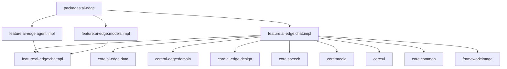
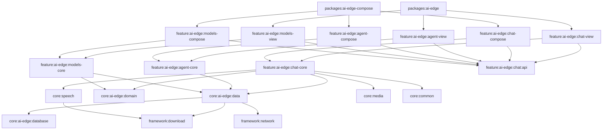

# View 与 Compose 双体系架构蓝图

> 本文档基于对 `packages/ai-edge` 宿主工程的真实代码审计，描述从当前 View 体系演进到 View + Compose
> 双版本并行的最终架构蓝图。目标是：底层与业务逻辑复用，UI 渲染层彻底物理隔离。
---

## 一、审计范围与结论摘要

### 1.1 审计范围

本次蓝图只围绕 `packages/ai-edge` 向下追踪的真实物理模块展开，覆盖：

- 宿主：`packages/ai-edge`
- 业务：`feature/ai-edge/{agent,chat,explore,meeting,models,vision}` 的 `api/impl`
- 基础：`core/{common,media,res,speech,ui,ai-edge/*}`
- 框架：`framework/{download,image,mlkit,network,player}`

### 1.2 统一结论

当前工程已经具备“共享业务核 + 双 UI 壳”的迁移前提，但必须严格按以下边界执行：

- **业务核可下沉**：`chat/agent/models` 的 ViewModel 与纯状态类可迁移到 `*-core`
- **UI 壳必须隔离**：`Activity/Fragment/Adapter/XML/RecyclerView DiffCallback` 只保留在 `*-view`
- **Compose 壳独立打包**：`packages:ai-edge-compose` 只依赖 `*-compose` 与 `*-core`
- **基础设施分级复用**：不是所有 core/framework 都“完全纯净”，必须按真实依赖重新归类

---

## 二、全局模块复用性分类清单

### 2.1 完全复用模块

| 模块                        | 依赖与证据                                                  | 结论     |
|---------------------------|--------------------------------------------------------|--------|
| `framework:network`       | `Retrofit` / `OkHttp`，无 `android.view`                 | 完全复用   |
| `framework:download`      | `androidx.work.runtime.ktx`，无 View 组件                  | 完全复用   |
| `framework:image`         | `Coil` / `coil-okhttp`，Compose 原生可用                    | 完全复用   |
| `core:ai-edge:database`   | `Room` / `DAO` / `Entity`                              | 完全复用   |
| `core:ai-edge:data`       | `Repository`、网络、下载、LiteRT；`build.gradle.kts` 无 View 依赖 | 完全复用   |
| `core:ai-edge:domain`     | `UseCase`、`ActiveModelHolder`、仅 Hilt/Context 系统引用      | 完全复用   |
| `core:common`             | KTX / Lifecycle-process                                | 完全复用   |
| `core:speech`             | `SpeechRecognitionClient`、协程、下载框架                      | 完全复用   |
| 各 `feature:ai-edge:*:api` | 纯接口层，当前 `api` 模块无实现                                    | 完全复用底座 |

### 2.2 部分复用模块（含 View UI 依赖）

| 模块                          | 原因分析                                                                                                       | 结论                        |
|-----------------------------|------------------------------------------------------------------------------------------------------------|---------------------------|
| `framework:player`          | `framework/player/build.gradle.kts:12` 引入 `media3.ui`，属于 View 体系播放器组件；核心播放能力可复用，但 UI 组件不应进入 Compose 壳      | 部分复用（含 View UI 依赖）        |
| `framework:mlkit`           | `framework/mlkit/build.gradle.kts:18` 引入 `camera.view`，说明存在 `PreviewView` 这类 View 预览组件；算法能力可复用，预览 UI 需独立封装 | 部分复用（含 View UI 依赖）        |
| `core:media`                | `core/media/build.gradle.kts:11` 引入 `appcompat`，说明该层已混入 View 基础设施；可继续复用，但建议后续二次剥离                          | 可复用但建议二次剥离（因依赖 appcompat） |
| `core:ai-edge:data` 中部分仓库能力 | `ModelsManagerViewModel` 仍直接触达文件路径与状态读取，说明数据层与平台能力边界需要再抽象                                                  | 部分复用，需平台网关                |

### 2.3 必须双轨隔离模块

| 模块                    | 原因分析                                                                                                                      | 结论                                   |
|-----------------------|---------------------------------------------------------------------------------------------------------------------------|--------------------------------------|
| `core:ui`             | `core/ui/build.gradle.kts:11-12` 直接依赖 `appcompat` / `material`，且包含 `BaseUIActivity`、`VoiceWaveView`、RecyclerView 相关 UI 组件 | 必须双轨隔离                               |
| `core:res`            | `core/res/build.gradle.kts:11-12` 直接依赖 `appcompat` / `material`，属于 View 资源体系                                              | 必须双轨隔离                               |
| `core:ai-edge:design` | `core/ai-edge/design/build.gradle.kts:10` 依赖 `material`，是 View 风格设计系统                                                     | 必须双轨隔离                               |
| `packages:ai-edge`    | 宿主当前直接装配 `Fragment impl`，无法作为 Compose 独立壳继续演进                                                                             | 必须双轨隔离，新增 `packages:ai-edge-compose` |

---

## 三、重构后模块依赖拓扑图

### 3.1 当前现状拓扑



### 3.2 目标拓扑



### 3.3 职责边界

- `*-core`：共享业务状态、ViewModel、UseCase、纯状态类
- `*-view`：传统 XML/View/Adapter/DiffCallback
- `*-compose`：Compose Screen、Route、UI 组件
- `api`：跨 UI 版本共享的导航/契约

---

## 四、ViewModel 与状态类下沉体检

### 4.1 判定标准

满足以下任一条件即不能直接下沉：

- `import android.view.*`
- `import android.widget.*`
- `R.layout` / `R.id`
- `Fragment` / `Activity`
- `RecyclerView.Adapter`、`ViewHolder`、`DiffUtil`

### 4.2 可直接下沉的 ViewModel / 状态类

| 类                        | 审计结论                                                                |
|--------------------------|---------------------------------------------------------------------|
| `ChatDetailViewModel`    | 可下沉到 `chat-core`；无 View 污染导入，`Context` 仅为 `ApplicationContext` 系统引用 |
| `ChatHomeViewModel`      | 可直接下沉到 `chat-core`                                                  |
| `AgentHomeViewModel`     | 可直接下沉到 `agent-core`                                                 |
| `ModelsManagerViewModel` | 可下沉到 `models-core`，但需先做仓库化隔离                                        |
| `ChatDetailUiState`      | 可直接下沉                                                               |
| `ChatDetailEffect`       | 可直接下沉                                                               |
| `VoiceInputUiState`      | 可直接下沉                                                               |
| `SelectedImageState`     | 可直接下沉                                                               |
| `ModelManagerUiState`    | 可直接下沉                                                               |
| `ModelUiState`           | 可直接下沉                                                               |

### 4.3 明确禁止下沉的类

| 类                      | 原因                                                             |
|------------------------|----------------------------------------------------------------|
| `ChatHomeDiffCallback` | 直接依赖 `androidx.recyclerview.widget.DiffUtil`，必须保留在 `chat-view` |
| `ModelDiffCallback`    | 直接依赖 `DiffUtil` 和 `Bundle`，必须保留在 `models-view`                 |

---

## 五、ApplicationContext 与仓库化隔离

### 5.1 现状边界

`ApplicationContext` 本身不是 UI 污染，但以下逻辑不应继续停留在 ViewModel 内：

- `ModelsManagerViewModel.kt:94-97`：直接 `File(...).delete()`
- `ModelsManagerViewModel.kt:115-117`：直接根据 `appContext` 计算下载状态
- `ChatDetailViewModel.kt:114-118`：把 `Context` 传入初始化流程

### 5.2 标准化解耦方案

`models-core` 必须先定义平台网关接口：

```kotlin
interface ModelStorageGateway {
  suspend fun deleteModel(model: Model): Boolean
  fun getDownloadStatus(model: Model): ModelDownloadStatus
}
```

然后在 `core:ai-edge:data` 或独立的 `models-platform` 中提供 Android 实现，负责：

- `File` 读写
- 路径计算
- 下载状态扫描
  ViewModel 只依赖 `ModelStorageGateway`，不直接操作文件系统。

---

## 六、Hilt 注入链与编译闭环

### 6.1 依赖来源

| ViewModel                | 注入项                                                    | 物理来源                                        |
|--------------------------|--------------------------------------------------------|---------------------------------------------|
| `ChatDetailViewModel`    | `ChatRepository`、`AgentRepository`、`ActiveModelHolder` | `core:ai-edge:data` / `core:ai-edge:domain` |
| `ChatHomeViewModel`      | `ChatRepository`、`AgentRepository`                     | `core:ai-edge:data`                         |
| `AgentHomeViewModel`     | `AgentRepository`                                      | `core:ai-edge:data`                         |
| `ModelsManagerViewModel` | `InitModelConfigUseCase`、`ActiveModelHolder`           | `core:ai-edge:domain`                       |

`RepositoryModule.kt` 和 `DataModule.kt` 负责 Hilt 的底层装配，必须随 `core:ai-edge:data` 一并保留。

### 6.2 必须消除的编译隐患

当前 `ChatNavigator` 仅由 `chat:impl` 的 `ChatsExportModule` 提供绑定。若 Compose 壳去掉 `chat:impl`
，则：

- `@Inject lateinit var chatNavigator: ChatNavigator`
- 会因为无绑定而编译失败。

### 6.3 标准规范

Compose 侧必须新增以下任一方案：

1. `chat-compose-navigation` 独立模块，提供 `@Binds ChatNavigator`
2. 或者直接在 `chat-compose` 内提供 `@Binds ChatNavigator`
   这样才能确保：

- View 壳使用 `ChatNavigatorImpl` 启动 Activity
- Compose 壳使用 `ChatComposeNavigatorImpl` 路由到 `ChatScreen`

---

## 七、最终搬迁清单

### 7.1 可直接下沉

- `chat-core`
    - `ChatDetailViewModel`
    - `ChatHomeViewModel`
    - `ChatDetailUiState`
    - `ChatDetailEffect`
    - `VoiceInputUiState`
    - `SelectedImageState`
- `agent-core`
    - `AgentHomeViewModel`
- `models-core`
    - `ModelManagerUiState`
    - `ModelUiState`

### 7.2 需微调后下沉

- `ModelsManagerViewModel`
    - 先抽 `ModelStorageGateway`
    - 再移除 ViewModel 内的文件系统直接操作
- `core:media`
    - 保留复用，但建议后续拆分 `media-contract` / `media-android`
- `framework:player`
    - 播放核心复用，`media3-ui` 只留在 UI 壳
- `framework:mlkit`
    - 算法复用，`camera.view` 只留在 UI 壳

### 7.3 禁止下沉

- `ChatHomeDiffCallback`
- `ModelDiffCallback`
- 全部 `Activity` / `Fragment` / `Adapter` / XML
- `core:ui` 的 View 组件
- `core:res` 的 View 资源主题
- `core:ai-edge:design` 的 Material View 设计系统

---

## 八、Compose 壳工程依赖样例

```kotlin
plugins {
  alias(libs.plugins.convention.android.application)
  alias(libs.plugins.kotlin.serialization)
  alias(libs.plugins.ksp)
  alias(libs.plugins.hilt)
}
android {
  namespace = "com.sofar.ai.edge.compose"
  defaultConfig {
    applicationId = "com.sofar.ai.edge.compose"
    versionCode = 1
    versionName = "1.0"
  }
  buildFeatures {
    compose = true
  }
}
dependencies {
  implementation(libs.androidx.activity.compose)
  implementation(platform(libs.androidx.compose.bom))
  implementation(libs.androidx.compose.ui)
  implementation(libs.androidx.compose.material3)
  implementation(libs.androidx.navigation.compose)
  implementation(libs.hilt.android)
  ksp(libs.hilt.compiler)
  implementation(libs.hilt.navigation.compose)
  implementation(project(":core:ai-edge:data"))
  implementation(project(":core:ai-edge:domain"))
  implementation(project(":core:ai-edge:database"))
  implementation(project(":core:common"))
  implementation(project(":core:media"))
  implementation(project(":core:speech"))
  implementation(project(":framework:network"))
  implementation(project(":framework:download"))
  implementation(project(":framework:image"))
  implementation(project(":core:ui-compose"))
  implementation(project(":core:ai-edge:design-compose"))
  implementation(project(":feature:ai-edge:chat-core"))
  implementation(project(":feature:ai-edge:agent-core"))
  implementation(project(":feature:ai-edge:models-core"))
  implementation(project(":feature:ai-edge:chat-compose"))
  implementation(project(":feature:ai-edge:agent-compose"))
  implementation(project(":feature:ai-edge:models-compose"))
  implementation(project(":feature:ai-edge:explore-compose"))
  implementation(project(":feature:ai-edge:meeting-compose"))
  implementation(project(":feature:ai-edge:vision-compose"))
  implementation(project(":feature:ai-edge:chat:api"))
  implementation(project(":feature:ai-edge:agent:api"))
  implementation(project(":feature:ai-edge:models:api"))
}
```

---

## 九、迁移顺序

1. 新建 `packages:ai-edge-compose`、`core:ui-compose`、`design-compose`
2. 新建 `chat-core`、`agent-core`、`models-core`
3. 新增 `chat-compose`、`agent-compose`、`models-compose`、`explore-compose`、`meeting-compose`、
   `vision-compose`
4. 在 Compose 壳中重建 `ChatNavigator` 的 Hilt 绑定
5. 抽离 `ModelStorageGateway`
6. 冻结旧 View `impl`，逐步替换宿主入口

---

## 十、实施原则

- ViewModel 只要没有 View 污染导入，就应作为共享业务核处理
- `ApplicationContext` 可以存在，但其越权文件操作必须移入仓库/网关
- `DiffCallback` 属于 UI 层实现，不进入 `-core`
- 含 `media3.ui`、`camera.view` 的基础库不应被归类为完全纯净
- Compose 壳必须独立于旧 View 壳打包，不能继续依赖 `chat:impl` 之类的 UI 实现模块
